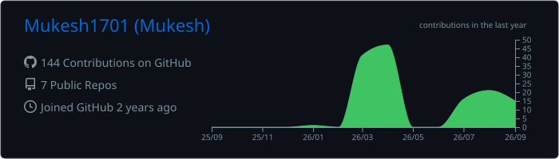
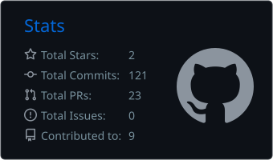
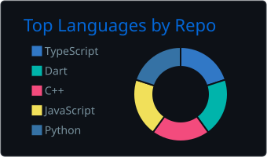
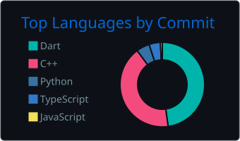
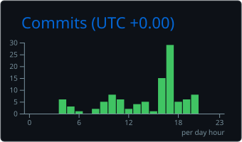

<h2 align="center">🚀 About Me</h2>

- 🔭 Building **[NutriScan AI](https://www.nutriscan-ai.in)** — an AI-powered food scanner with barcode health grades, NOVA scoring & ingredient alerts
- 🧠 Exploring **deep learning, computer vision & generative AI** (PyTorch, transfer learning, LLMs)
- 📱 Shipped **EduTracker** — a student activity points platform (Flutter + Spring Boot + MySQL) in a 5-member team
- 🤖 Built **Jarvis**, a Python voice assistant with wake-word detection & OpenAI integration
- 🌱 Currently learning **system design** and scaling ML-powered web apps
- 💬 Ask me about **Python, React, FastAPI, PyTorch**
- 📫 Reach me at **veeravallimukesh20006@gmail.com**

<h2 align="center">🔥 Featured Project</h2>

### [🥗 NutriScan AI](https://www.nutriscan-ai.in) — *Scan it. Grade it. Eat smarter.*

**Free AI food scanner** — point your camera at any barcode and instantly get a health grade (A–F), NOVA processing score, nutrition breakdown & ingredient alerts.
`React` `FastAPI` `PyTorch` `Open Food Facts` · **[Live 🌐](https://www.nutriscan-ai.in)** · **[GitHub 📦](https://github.com/Mukesh1701/NutriScan-AI)**

<h2 align="center">🛠️ Tech Stack</h2>

**Languages**

**AI / ML**

**Web & Mobile**

**Data & Tools**

<h2 align="center">📊 GitHub Stats</h2>

<!-- Cards are auto-generated daily by GitHub Actions inside this repo — no rate limits, always loads -->

  
  
   
  
  
   
  

  

  
  

